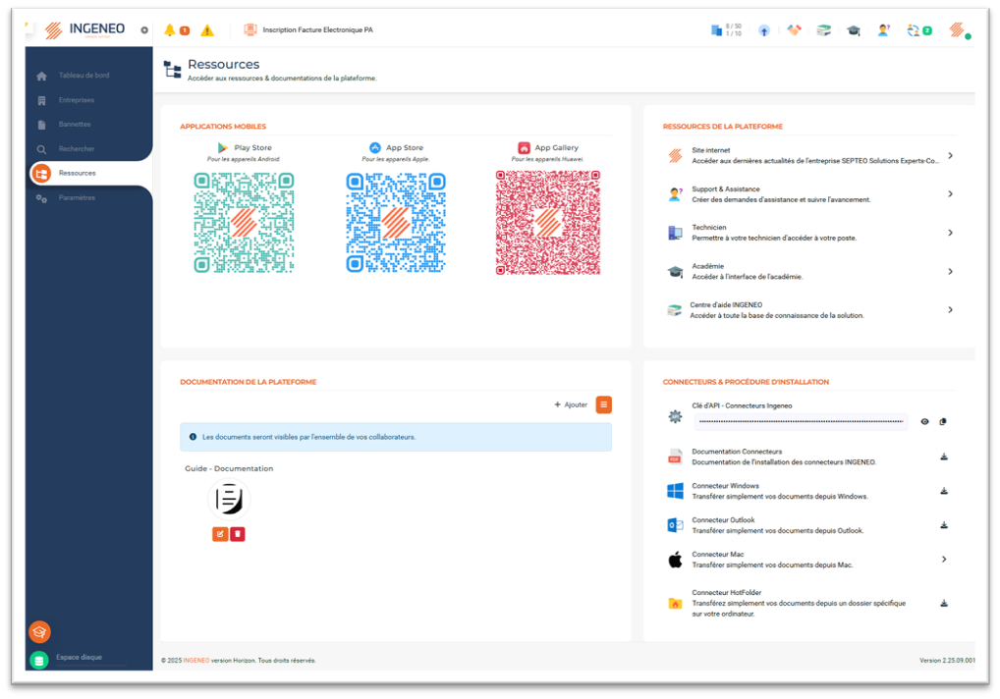

# Installation connecteurs MAC

Le connecteur MAC  permet à un utilisateur d’envoyer un ou plusieurs fichiers dans la plateforme à partir de son ordinateur MAC. Les documents envoyés se retrouveront dans la Bannette d’une entreprise sélectionnée et passeront à l’OCR automatiquement.

Pour installer les connecteurs, se rendre dans le menu « Ressources ».&#x20;

Cliquer sur « Connecteur MAC ».&#x20;

<figure><figcaption></figcaption></figure>

Sélectionner et installer l’application « INGENEO PushDoc » depuis l’Apple Store.

<figure><figcaption></figcaption></figure>

Saisir l’URL de la plateforme dans le champ « URL base de connexions au service Web ». L’information se trouve en haut dans la barre de navigation internet lorsque la plateforme est ouverte.

<figure><figcaption></figcaption></figure>

Copier/Coller dans le champ « identifiant de connexion au Webservice », la clé d’API – Connecteurs INGENEO qui se trouve dans le menu « Ressources » dans l’encart « CONNECTEURS & PROCEDURES D’INSTALLATION »&#x20;

Saisir « l’adresse mail » et « mot de passe » de connexion à la plateforme.&#x20;

Cliquer sur « Sauvegarder ».&#x20;

<figure><figcaption></figcaption></figure>

<figure><figcaption></figcaption></figure>

Sélectionner l’entreprise et le classeur dans lequel sera déposé le ou les documents.&#x20;

Cliquer sur « Sélectionner des fichiers ».&#x20;

<figure><figcaption></figcaption></figure>

Choisir le « dossier » où se trouvent les documents sur le MAC, puis sélectionner le ou les  documents à envoyer.&#x20;

Cliquer sur « Open ».&#x20;

<figure><figcaption></figcaption></figure>

Cliquer sur « Transférer ».

<figure><figcaption></figcaption></figure>

Le fichier se transfert vers l’entreprise et le classeur sélectionné.

<figure><figcaption></figcaption></figure>

